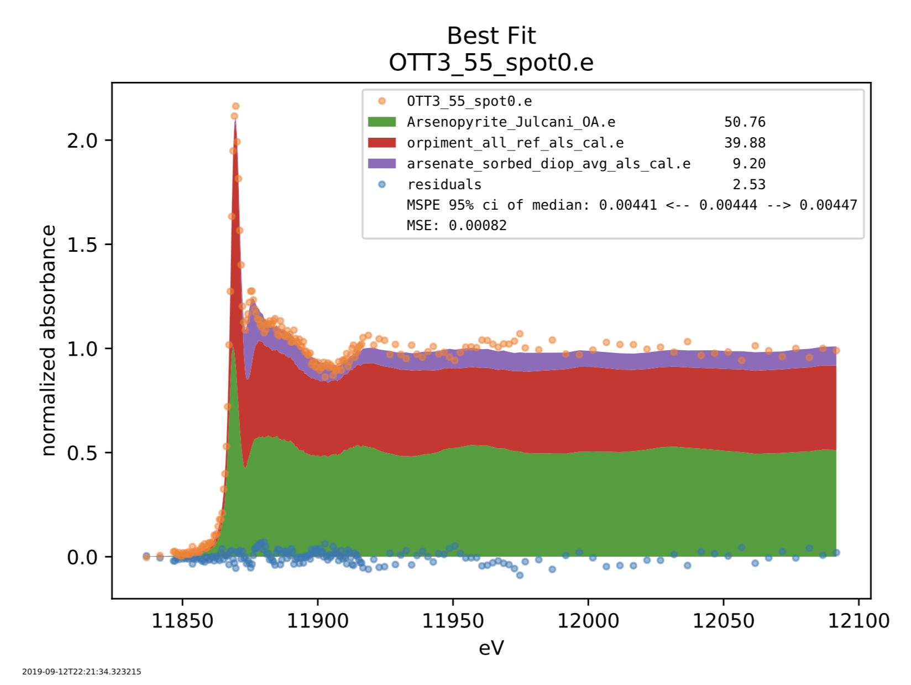

# MrFitty

MrFitty is an open-source Python package for fitting XANES data to a set of reference spectra using linear least
squares and best subset selection as described in *An Introduction to Statistical Learning with Applications in R* by
Gareth James, Daniela Witten, Trevor Hastie and Robert Tibshirani. It runs on any system with a Python 3.8+ interpreter
including Linux, OS X, and Windows.

MrFitty functions similarly to the spectra-fitting tools in the LabView software suite written by
Dr. Matthew Marcus at the Berkeley Synchrotron available [here](https://sites.google.com/a/lbl.gov/als-beamline1032/software-download>`).

* Free software: MIT license

## Overview

XANES spectrum fitting is a basic application of linear least squares: given the spectrum of an unknown sample and a library
of reference spectra find the combination of references that best fits the unknown. Fitting each individual group of references
to the unknown is simple, but selecting the 'best' combination of references from
the set of all fits is not simple.

A straightforward comparison of models using the sum of squared residuals (SSR) or the equivalent mean-square error
(MSE) seems to be a natural choice. But these choices overlook a purely numerical advantage held by the SSR of an
n-component model over any model with fewer than n components. This advantage is the result of using the same data to
both *fit* the model and *evaluate* the model. Classical statistics offers methods to make improved comparisons of SSR
and measures like it [2]. My objection to these methods is that they are difficult to interpret in terms of the data
itself.

*Prediction error* is a different approach to the model comparison problem that is computationally expensive but more
easily interpreted. A straightforward comparison of different models can be made if datasets
are partitioned into two parts, one for model fitting and the other for model evaluation. Then the model fitting
process does not interact with the model evaluation process. This is the basis for *cross-validation* and similar
methods including the method implemented by MrFitty.

Dividing a dataset into two parts is clearly insufficient for a robust “goodness of fit” measure, and it has been
common to see 5- and 10-fold cross-validation in machine learning literature, meaning datasets were divided into 5 or
10 partitions and each partition evaluated against a model fit to the remaining data. MrFitty uses a large number of
random partitions of the data to generate a robust “median prediction error” as well as a robust confidence interval of
the median prediction error. This confidence interval allows a well-defined criterion for saying either:

  * fit A is better than fit B, or
  * fit A is no better than fit B

by asking whether the confidence intervals of median prediction error overlap. This criterion is directly
interpretable in terms of the data since weaker models and weaker data can be expected to give larger confidence
intervals than stronger models and stronger data.

## Requirements

MrFitty requires Python 3.8+.

## Installation

Users should consider installing MrFitty in a [Python virtual environment](https://docs.python.org/3.6/library/venv.html).
This is not necessary but it simplifies package management by separating the system Python from the users' Python environments.
On systems without Python 3.8+ the [Anaconda](https://anaconda.org) or [Miniconda](https://docs.conda.io/en/latest/miniconda.html)
Python distribution is a good choice. Either one can be installed without administrative privileges and supports virtual environments.

### Method 1 (not recommended!)
If the standard Python 3.8+ distribution is available then MrFitty can be installed with pip:

    $ pip install git+https://github.com/jklynch/mr-fitty.git

### Method 2 (recommended)
Alternatively, MrFitty can be installed in a virtual environment using the standard Python 3.8+ distribution with the following commands:

    $ python3 -m venv mrf
    $ source mrf/bin/activate
    (mrf) $ pip install --upgrade pip 
    (mrf) $ pip install mrfitty

### Method 3 (recommended)
If the Anaconda or Miniconda distribution has been installed then MrFitty can be installed in a virtual environment with these commands:

    $ conda create python=3.8 --name mrf
    $ conda activate mrf
    (mrf) $ pip install mrfitty

In all cases the required packages will be automatically installed by pip.

## Update
Update MrFitty with pip as follows:

    (mrf) $ pip uninstall mrfitty
    (mrf) $ pip install mrfitty

## Usage
MrFitty runs from the command line.  The --help option will display usage instructions:

    $ mrfitty --help
    Usage: mrfitty [OPTIONS] CONFIG_FP

    Options:
      --help   Show this message and exit.

The required CONFIG_FP argument specifies the path to a configuration file written by the user, e.g.

    $ mrfitty ~/fit_arsenic_spectra.cfg

Here is an example configuration file that uses an existing PRM file:

    [fit]
    minimum_component_count = 1
    maximum_component_count = 3
    fit_method = lsq
    component_count_method = combination_fit

    [references]
    prm = reference/As_database_for_llsq_25_refs.prm

    [data]
    data/*.e

    [output]
    best_fit_files_dir = output
    plots_pdf_dir = output
    table_fp = output/fit_table.txt

    [plots]
    best_fits_plot_limit = 3

Here is an example configuration file that specifies reference files and fit parameters directly:

    [fit]
    minimum_component_count = 1
    maximum_component_count = 3
    fit_method = lsq
    component_count_method = combination_fit

    [references]
    reference/*.e

    [data]
    data/*.e

    [output]
    best_fit_files_dir = output
    plots_pdf_dir = output
    table_fp = output/fit_table.txt

    [plots]
    best_fits_plot_limit = 3

## Input
In addition to a configuration file the necessary input files are

  + at least two (but probably more) normalized reference spectrum files

  + one or more normalized spectrum files to be fit by the reference files

All input files must contain at least two columns of data. One column is
incident energy and the other column is normalized absorbance. Initial rows beginning
with '#' will be ignored except for the last row which must contain column headers.
For example, the following normalized file written by Athena can be used as
input to mr-fitty

    # Athena data file -- Athena version 0.8.056
    # Saving OTT3_55_spot0 as normalized mu(E)
    # .  Element=As   Edge=K
    # Background parameters
    # .  E0=11866.000  Eshift=0.000  Rbkg=1.000
    # .  Standard=0: None
    # .  Kweight=2.0  Edge step=0.004
    # .  Fixed step=no    Flatten=yes
    # .  Pre-edge range: [ -97.934 : -28.385 ]
    # .  Pre-edge line: 0.0068524 + -5.1098e-007 * E
    # .  Normalization range: [ 45.901 : 302.157 ]
    # .  Post-edge polynomial: 0.011539 + -5.5019e-007 * E + 0 * E^2
    # .  Spline range: [ 0.000 : 301.924 ]   Clamps: None/Strong
    # Foreward FT parameters
    # .  Kweight=0.5   Window=hanning   Phase correction=no
    # .  k-range: [ 2.000 : 6.902 ]   dk=1.00
    # Backward FT parameters
    # .  R-range: [ 1.000 : 3.000 ]
    # .  dR=0.00   Window=hanning
    # Plotting parameters
    # .  Multiplier=1   Y-offset=0.000
    # .
    #------------------------
    #  energy norm bkg_norm der_norm
      11766.697      -0.80039166E-02  -0.80037989E-02   0.61484012E-03
      11771.697      -0.49320333E-02  -0.49319157E-02   0.12085377E-02
      11776.697       0.40723503E-02   0.40724678E-02   0.17648519E-04
      ...

## Output
Several output files will be produced:

  + a single PDF containing plots of each fitted spectrum
  

  

  + a single table in text format with the best fit information for each fitted spectrum
  + one file per fitted spectrum with four columns of data:

     +  incident energy
     +  fitted normalized absorbance value
     +  residual of the fit
     +  input normalized absorbance

## References
[1] Gareth James, Daniela Witten, Trevor Hastie and Robert Tibshirani, *An Introduction to Statistical Learning with Applications in R*

[2] Calvin, Scott, *XAFS for Everyone*, 2013, CRC Press
